# Season1 Episode10

> 由于视频文件过于庞大，不方便上传，希望在阅读笔记之前，自己要有《老友记》的资源
> 
> **先将这一集看一遍**，然后根据个人的学习习惯再开始学习~~

关键词： New Year's

## 正文

正片开始是一个过长的画面，寒冷冬日的纽约街头，交代了当前的时间。

```
Ross: Guys? There's uh somebody I'd like you to meet.
```

Ross带了一只🐵回来，取名为Marcel。而这只猴将在未来的几集中频繁出现以及发情...

So, 我们来看看Ross说的这句话。

- 这里的`I'd = I would`，`would like to do sth.`是一个非常常用，且客气的说法。`意为愿意做某事，喜欢做某事。`我们比较常用的场景比如你和其他人在餐馆要点餐，你就可以来一句`I'd like to have a tea.`还有一种场景比如你想询问对方的意见`would you mind...`你介意我...嘛？
- 这里有一个变形就是`would like sb to do sth.`加了一个sb，就是非常客气的语气表示`想让某人做某事`。

---

```
Rachel: Oh, he is precious! Where did you get him?
```
- Rachel用了一个词`precious`, 意为`adj. 宝贵的，珍贵的，贵重的，可爱的`。这里当然是可爱的意思。但是这个词我个人感觉更多的是形容珍宝之类的非常贵重的东西，表示很稀有贵重很好很棒的意思。
- 说到形容一个东西很棒，或者形容一个人很帅、很美，或者很可爱之类的，我们之前学习过，现在又多了一种表达。`cute / gorgeus / lovely / beautiful / precipus`。

--- 

```
Monica: Ross, is he gonna live with you, like, in your apartment?
```
- 这里有一个很简单的口语表达，非常简单地道好用但经常会被我们忽略就是`like`。真的要给这个词斜体加黑。

  你们知道英语不像我们汉语博大精深，一个`打`就有好多种含义。这个`like`就稍微有那么一点汉语的感觉。这里表示`比如`的意思。所以我们在口语中，就不要再用`for example`了。不是不好，有点不够口语化。

--- 

```
Ross: Yeah, I mean, it's been kind of quiet since Carol left, so...

Monica: Why don't you just get a roomate?

Ross: Ah~ I don't konw. You reach a certain age, 
      having a roomate is just kind of pathe...
     
      Uh, sorry, that's 'pathet', which is Sanskrit for
      'really cool way to live'.
```

- 这里这个知识点需要你看过视频才有感觉，就是Ross这个机智的急转弯，通过一个读音上的区别来改变一个词。

  而这里用到的正式我们常说的单词`重音`！ 我们看一个单词的音标总会发现这个符号`'`，他就是用来标出这个单词的重音所在位置。

- 这里的`Sanskrit`意为`梵文`。显然是Ross胡扯的。
  
---

```
Joey: It's just  such a slap in the face, you know?
```

- joey这个表达很有趣，`slap`意为`掌掴，猛击`其实就是给你一大嘴巴子的意思。Joey用`slap in the face`表示别人对你的`侮辱`。

---

然后，来到了本集的主线，**大家的New Year怎么过呢？**

我不知道外国的习俗是什么样的，反正在老友记里，New Year是有Party的，然后在跨年的那一刻，大家都会找一个伴接吻~~

但是。

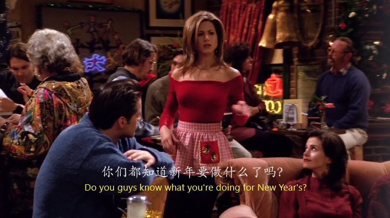


```
Chandler: You don't have to face the horribel pressures of holidays.

desperate scrambel to find anything with lips
```

- Chandler这句话就是在说，你不是单身狗哈，你不会理解我们单身狗面对跨年接吻有多大的压力！！！


**于是大家初步决定，就我们自己6人，一起吃一顿饭，不要party, 不要跨年接吻！**

---

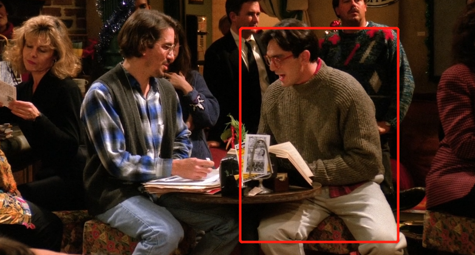

这时候，重要的任务登场了。这是Pheobe真正爱过的两个人中的一个，David，后面还会有第二个人出现，然后他俩为了Pheobe而大打出手。

哈哈哈哈哈哈，我胡说的，我们看到那里再说。也是一段让我酸甜酸甜，含泪把民政局搬来的爱情。


---
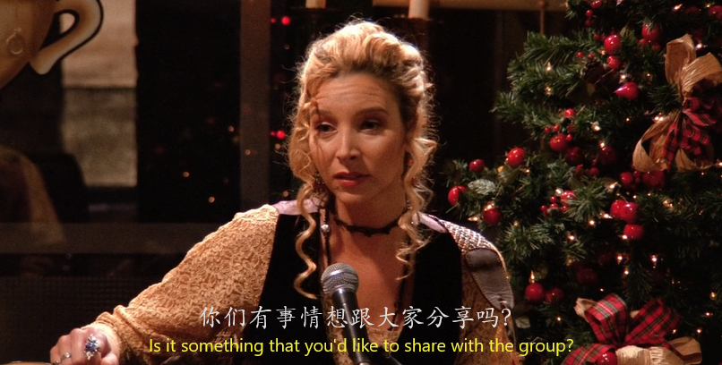
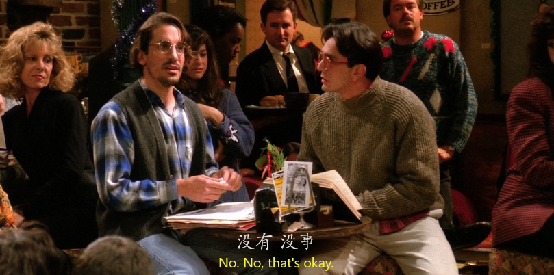


```
Chandler: That's guy going home with a note!
```

这里注意Chandler的这个表达。就记住就行。一种很幽默的表达`上了一课，得到教训`。

---

接下来这几句话，我希望在座的所有男士，忘记晚上吃饭都不要忘记这几句话。都拿小本本记下来！！！

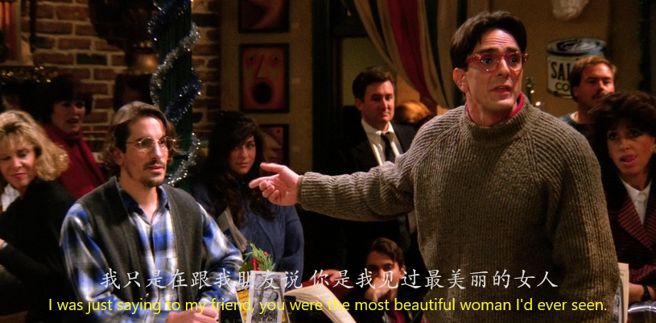

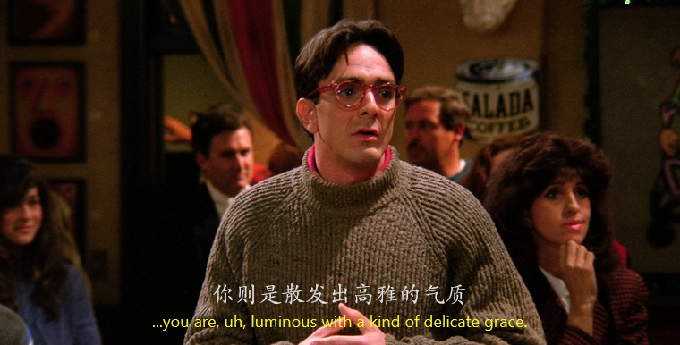

David不愧是有文化的人，理工男的老实又流露出一丝丝痴情，情话说的更是好听(当然在David本身的立场他就是实话实说)

文化人用的形容词都是不一样的

```
David: you are, uh, luminous with a kind of delicate grace.
```
- 这里是意译成了散发出优雅的气质，我们既然学习这句话，就直接的白话翻译一下，才能体会到是怎么个修辞手法。

  `luminous`是形容词发光的，`delicate`是形容词微妙的，同时修饰名词`grace` ,grace这个词一般就是优雅的，魅力的意思来形容一个人。
  翻译出来就是`发着淡淡光芒的优雅`。这哪个女生听了不得魂都飞走了。

- 而`grace`偏向恩泽之类的意思，则相对会和宗教，以及欧洲古代的等级制度相对挂钩。

  看过`权力的游戏`的小伙伴应该很熟悉，里面称呼某个家族的统领男性都是`my lord`,称呼什么什么王都是`your grace`，称呼家族统领的妻子等有地位的女性都是`my lady`。这里的your grace就是一个尊称。

---

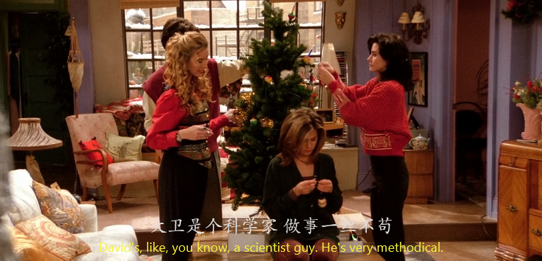
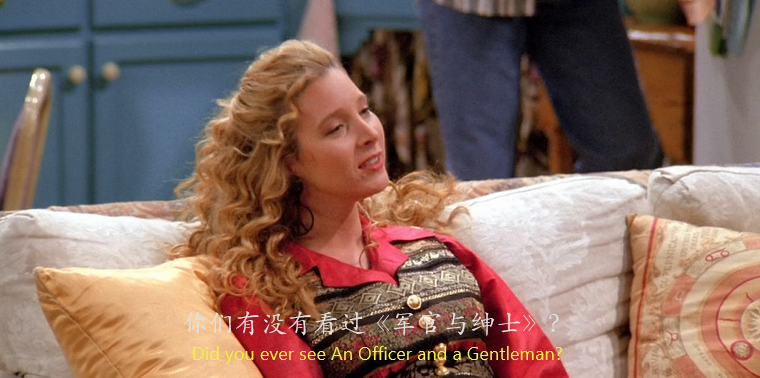

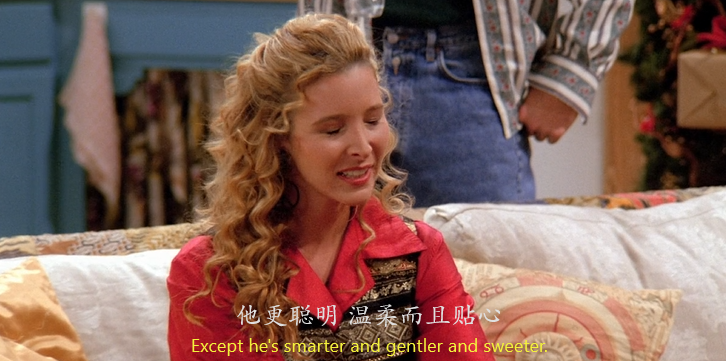

```
Pheobe: He's kind of like the guy I went to see that with.

        Except he's smarter and gentler and sweeter.
```

- 注意看这句话用到了`比较级`，而引领这个比较级的词是`except`。我们来理一下这句话的逻辑。

  他就是我想一起看那部电影的类型，`除了`他更聪明，更绅士，更贴心。
  这里的除了是在`强调`David比内心喜欢的内种类型`还要好`。所以用到了比较级。

---

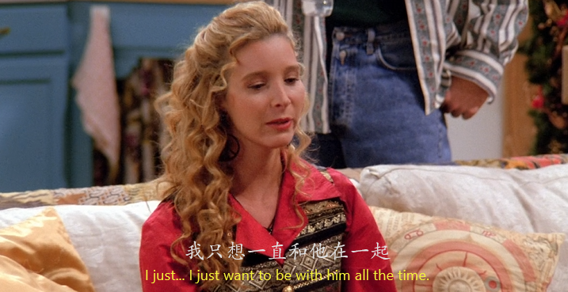
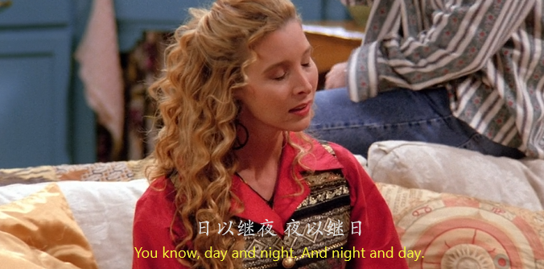
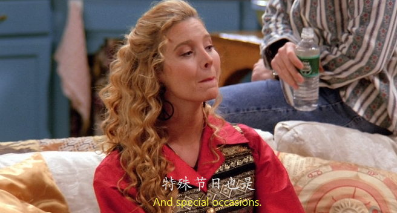

而Pheobe说着说着，就把话说到重点。

**先前大家都说好在跨年的时候只有他们六个人，一起好好吃一顿饭。**而现在Pheobe则想反悔。

---

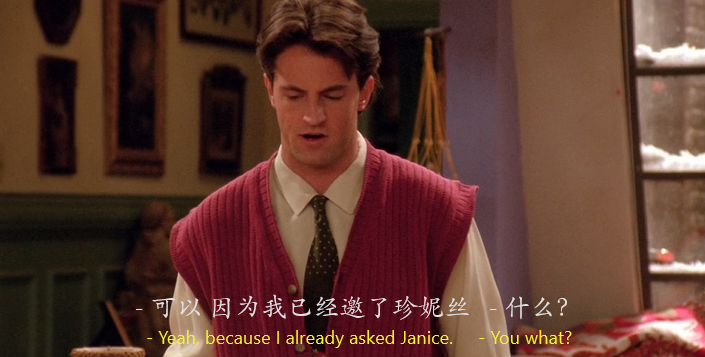

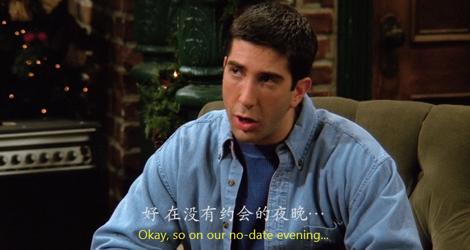
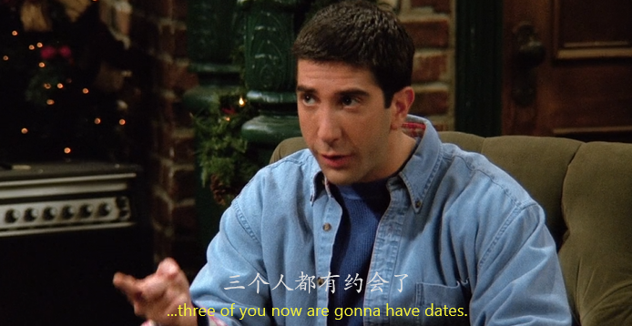
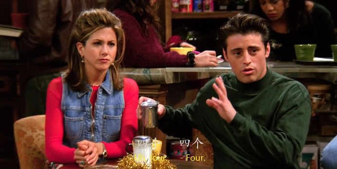
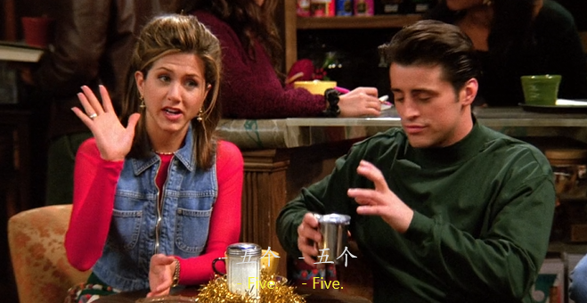

结果大家当时约定好的跨年夜都纷纷毁约，除了Ross，全部都找到了跨年kiss的对象。

---

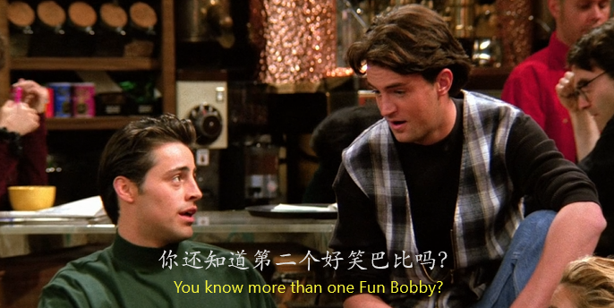
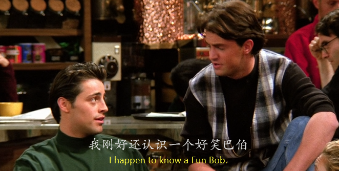

- `happen to do sth`意为`刚好做某事`，表示你`正好，巧了之类的意思。`我刚好有一支笔`I happen to have a pen.`是一个很常用的表达。

---


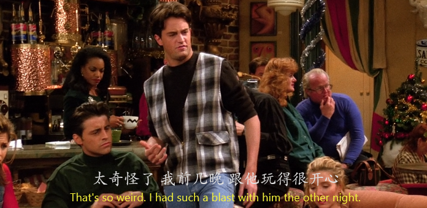

```
Chandler: That's so weird.

          I had such a blast with him the other night.
```

- `weird`,是我们之前说过的表示`奇怪`的词，我们来复习一下，有`odd / weird / geek / nerd`。后两个表示`奇怪的人`。
- `blast` 意为`爆炸，一阵疾风`的意思，在这句话是一个名词。`have a blast with sb/sth`表示和某人某事过得开心愉快。非常棒的一个表达，不要再说`we have such a great time`了！！

---

结果大家在跨年party上都没有能按照自己的计划行使

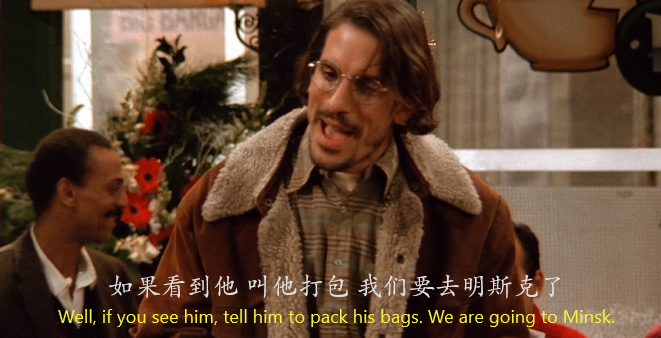

David去了俄罗斯

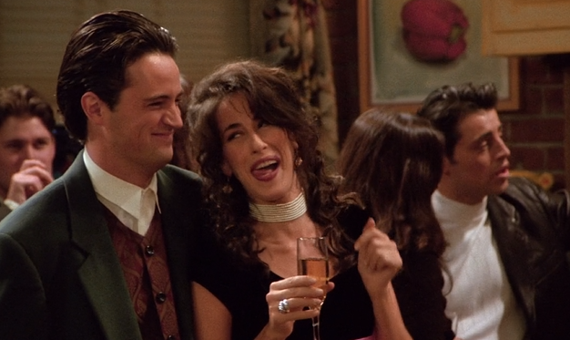

Chandler被Jenise逼疯
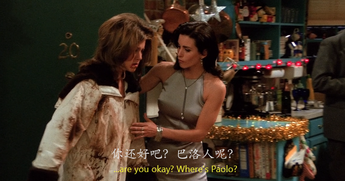

Rachel在机场被暴躁大妈殴打
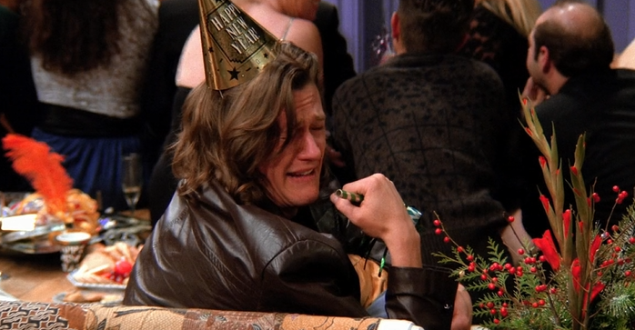

Fun Bobby 变成sad Bobby
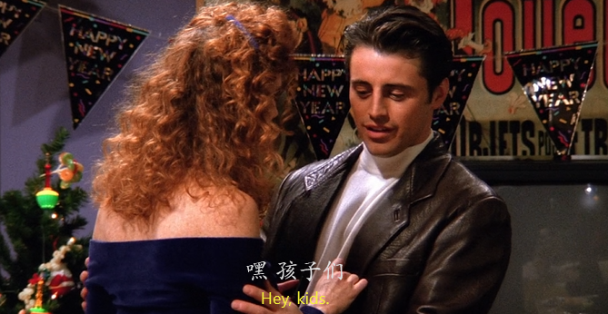

而Joey的情人却带着孩子来


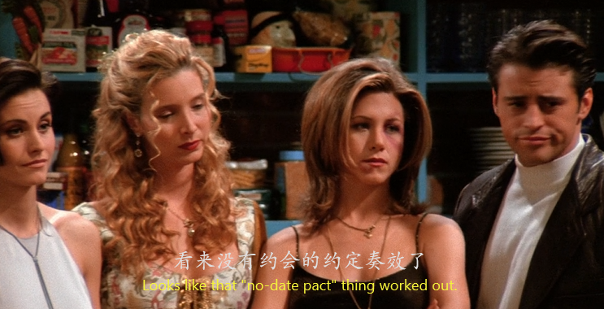

**还是那句话，大家的节日总是那么戏剧化。感恩节，到现在的跨年。最后还是履行了当时的No date pact**。


## Vocabulary

- precious *adj.* 宝贵的，珍贵的，贵重的，可爱的
- rescue *v.* 营救，救援，抢救
- cruel *adj.* 残忍的， 使人痛苦的，无情的
- Sanskrit *n.* 梵文
- scrambel *v.* 攀登，爬，抢夺 *n.* 掠夺者
- conventional *adj.* 传统的，平常的，约定的
- luminous *adj.* 发光的， 明亮的， 清楚的
- delicate *adj.* 微妙的，熟练的，纤弱的，易损的
- grace *n.* 恩泽，优雅，慈悲，魅力
- methodical *adj.* 有条不紊的， 有方法的， 井然有序的
- blast *n.* 爆炸，一阵疾风 *v.* 摧毁， 枯萎， 攻击