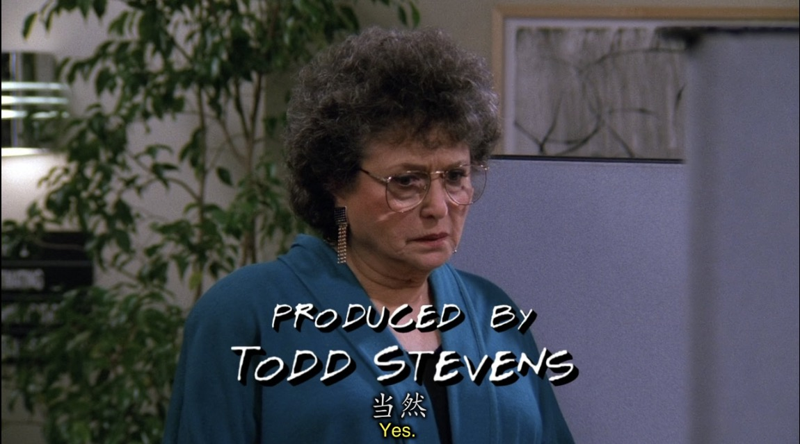
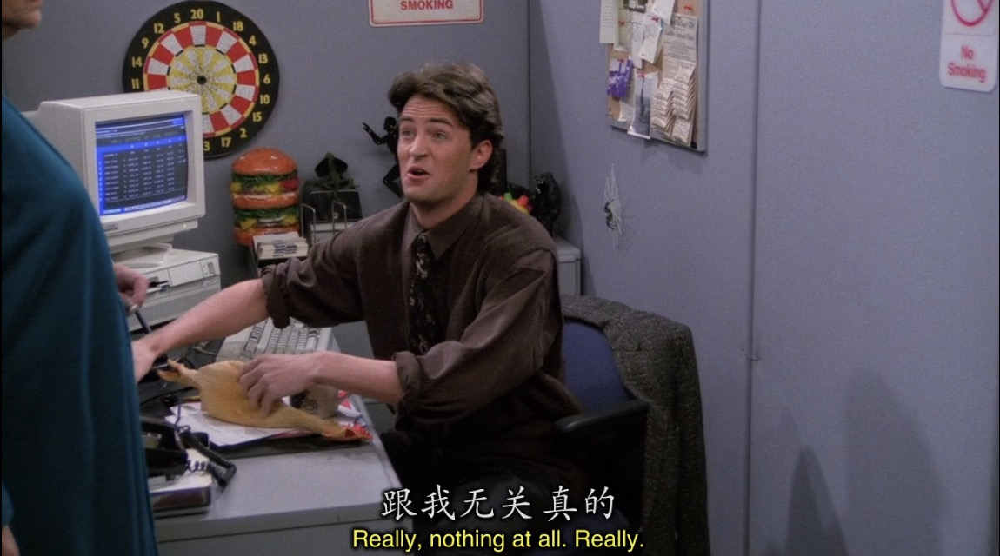

# Season1 Episode 15 - The One with the Stoned Guy

> 声明：
>       
>      所有内容只用于学习，如有侵权请告知。
>
>      如想转载请标明出处(github.com/hanqizheng)
>      
>      先看一遍原剧集再来阅读效果更佳
> 
>      希望可以Star支持一下😄
>
> 

## Key word:  *Job*

## 概要


## 正文

伴随着无情的上班划水机器Chandler抽搐的右手，我们先来学一段彩虹🌈屁

```
Chandler: Miss Tedlock, you're looking lovely today.
          May I say that is very flattering sleeve length on you?
```

- **flatter** 这个词我个人感觉多半是用于表达相对好的意思，虽然她有`奉承`的含义，但是一般表达的意思是`受宠若惊`。
- **flatter onself on sth**意为`在某事上自命不凡`。

我们注意到这句话Chandler用的是Miss，我们在小学就学过Miss是称呼没有结婚的女性的。而Tedlock如下图



所以这可能就是这段的笑点所在吧？？？

---

```
Miss Tedlock: Well, Mr.Costilick would like you to stop by his office at the end of the day.
```

- 分析一下这句话，`would like to do sth`是非常客气的语气，用于询问或者表达诉求。
  
  比如你想让地铁上的一个人往一边坐一坐，你就可以用这个句式`Would you like to move a little bit so that I can sit here?`这样说出来的话就比`Can you move...`要客气太多。第二句像是在引战准备干架了。

  还有假如我现在在国外一家高档餐厅，旁边有服务员等我点菜，这时候我就可以说`I'd like to have ...`就会显得自己很有逼格。不会发生`I want to eat...`的迷幻行为。

- `by his office`这里的by被用来当作`go to`的意思，我个人感觉是因为前面用到了stop。如果要用go to就变成了`would you like to stop to go to his office...`,太绕口了这句话，这也是介词神奇的地方。

---



哈哈哈哈哈看看Chandler手里拿着什么？？？？原来尖叫🐔在94年就有了。

---

其实每次在我想说英语的时候，我说出来的句子90%的错误源于三单和时态。所以我们如何用正确的时态来表达一句话，是非常重要的。

下面这段话正好是一个非常非常好的例子。

```
Phoebe: Hey, you guys!
        Chandler's comming, and he says he has this incredible news.
        So when he gets here, let's all act like , you know...

Chandler: So, it's a typical day at work. I'm inputting my numbers and big AI calls me into his office
          and tells me he wants to make me processing supervisor.

```
- 这段话描述了哪几种事件情况的事呢？
  - 第一件事是Chandler马上要来了，这里是用`be doing`也就是现在进行时表将来。
  - 第二件是Chandler跟Phoebe说了他有一件很棒的事要和大家分享。这里用的是`he says`一般现在时表示事实。因为这件事已经是一个事实了（其实这里我有点不明白，我以为会用`he said`
  - 第三件事是Chandler陈述老板叫他去告诉他升职的事。这里用的全部都是一般现在时和现在进行时，完全没有用一点过去式的东西。
- 第一部分的描述完全可以理解，都是相对合乎所学时态知识的。
- 第二件事这里Phoebe用一般现在时而不用一般过去时是因为（纯属个人观点，如果你有一些观点可以issue告诉我哦）`Chandler马上就要走过来了，从Chandler告诉她到他陈述这件事之间间隔的事件很短很短，所以可以视为现在发生的事。`
- 第三个我没有比较好的解释，因为我们知道过去时一般都会跟随一个时间来提示是过去的事情，比如`You told me that before. / I said something bad to her last night.`。但是这句话中Chandler用的却是`It's a typical day.`这明显不是一个形容过去的时间，而是一个一般现在时的陈述，所以，就确定了整句话的时间点。
- `make me process supervisor`意为`让我成为...`
注意一下这个表达。许多时候吵架我们可以听到`you made me!`有的时候表示`是你逼我的！`有的时候表示`都是你！让我成为这样了！`

---

```
Monica: You see, it's just this night has to go just perfect , so, you know...
        Windy's more a professional waitress.

Rachel: Oh~~ 
        Yes, I see. I'v sort of been maintaining my amateur status so that I can
        waitress in the Olympics.
```

Rachel显然是对Monica找别的waitress而不用自己很不爽。但是其实也不能怪Monica，在本集开头部分，Rachel给Monica端上的咖啡就把配有的饼干棒和橡皮擦搞混了。对于对任何事都要求完美的Monica来说，而且这件事更是关乎到Monica工作的事，她选择不用Rachel。

- 这了注意Rachel这句话`I have ... been doing ...`使用到了`现在完成进行时`。这个时态表示一件事情从过去就开始做，做到现在，并且还要持续的做下去(或者刚刚结束)时要用到这个时态。

  而Rachel这句话翻译过来的意思是`哦， 那合着我只要保持我的业余水准再过不久我就能在奥运会当服务员了。`这句话要从过去开始一直进行到现在且还要持续下去的动作是`保持，也就是maintain`。

---

```
Chandler: It's okay, I was always rooting for you two kids to get together.
```

- `I was doing ...`这里用到了`过去进行时`。表示过去某段时间进行的事情。这里Chandler用了always，表示`过去一直`。
- `root for sb.`表示`支持某人，挺某人`.

---

```
Joey: Hey, Chandler while you were sleeping, the guy from your old job called again.
```

- `while`就是引导`时间状语从句`最典型的词。还有一个就是`when`,他俩的区别是：
  - when用来引领`短暂动作`，比如`下面这个例子`
  - while用来引领`持续性动作`,比如Chandler说的这句话。支持是一个持续的动作。whiel 一般引领的动词都是ing形式的。

---

这个例子

```
Monica: You know Rachel, when you ran out on your wedding.
        I was there for you.
        I put a roof over your heada and if that's mean nothing to you...
        Twenty dollars an hour.
```

Monica其实每次都是最理性也最不理性的人。她在这会儿及时的刹住车，没有说出什么狠话，而是一句Twenty dollars an hour让事情不要再尴尬。

- `when you ran out on your wedding...`,这里就是一个典型的when引导的时间状语从句。


## Vocabulary

- flatter **vt.** 使...感到荣幸， 奉承
- eclectic **adj.** 兼收并济的
- apitude **n.** 天资
- appetite **n.** 食欲，欲望
- appetizer **n.** 开胃菜
- maintain **vt.** 维持,供养，坚称
- amateur **n.** 业余爱好者， 外行
- panic **n.** 恐慌 ｜ **vi.&vt.** 感到恐慌，使恐慌
- bail **n.** 保释金 ｜ **vt.** 保释
- blaze **n.** 大火， 火灾 ｜ **vi.**熊熊燃烧